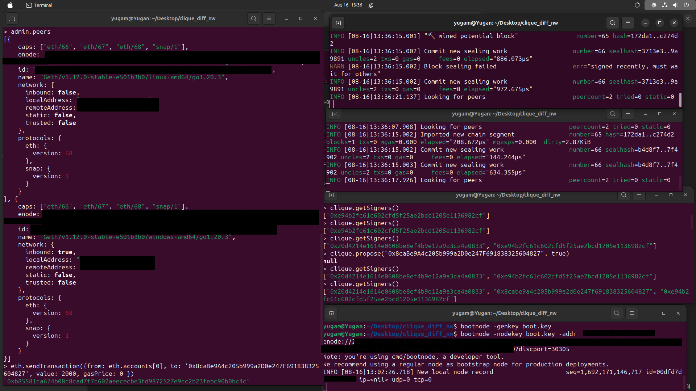
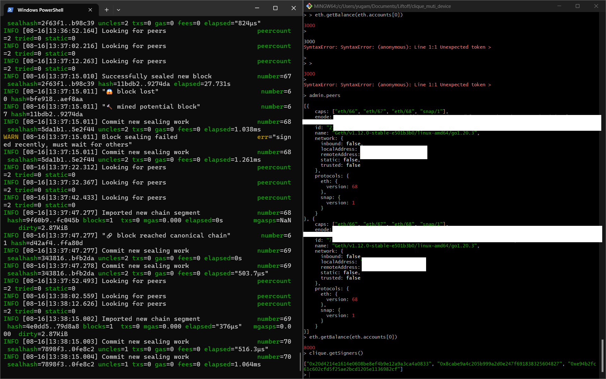
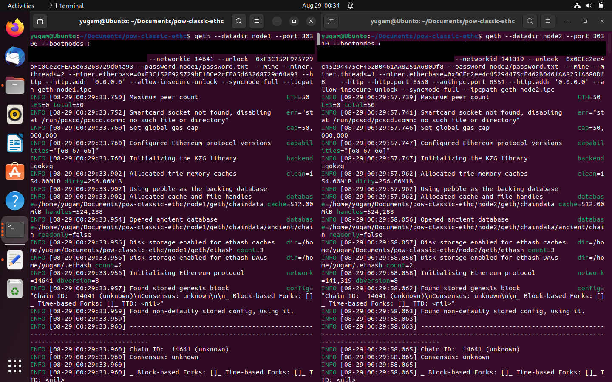
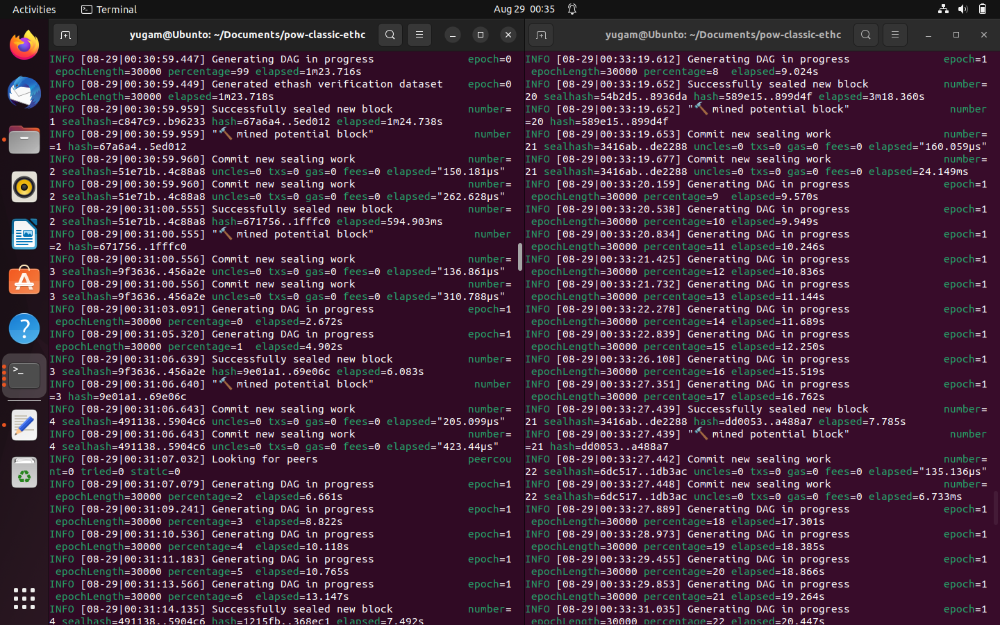

# Ethereum private chain 🔗

- Proof of Work
- Proof of Authority

## Proof Of Authority
[Proof Of Authority](https://medium.com/coinmonks/proof-of-authority-ac34f1b3a2c2) is a consensus mechanism that involves trusted notes acting as Authority to create blocks.
Private chain setup on devices(Windows and Ubunto) on different networks.
Implementation was done using [geth](https://geth.ethereum.org/docs)

### Genesis file

```
{
  "config": {
    "chainId": 12345,
    "homesteadBlock": 0,
    "eip150Block": 0,
    "eip155Block": 0,
    "eip158Block": 0,
    "byzantiumBlock": 0,
    "constantinopleBlock": 0,
    "petersburgBlock": 0,
    "istanbulBlock": 0,
    "berlinBlock": 0,
    "clique": {
      "period": 30,
      "epoch": 30000
    }
  },
  "difficulty": "1",
  "gasLimit": "8000000",
  "extradata": "0x0000000000000000000000000000000000000000000000000000000000000000E94B2fc61C602cfd5F25ae2bcD1205e1136982cF20d4214e1614e0608BE8eF4B9e12a9A3ca4a0833000000000000000000000000000000000000000000000000000000000000000000000000000000000000000000",
  "alloc": {
    "E94B2fc61C602cfd5F25ae2bcD1205e1136982cF": { "balance": "900000000" },
    "20d4214e1614e0608BE8eF4B9e12a9A3ca4a0833": { "balance": "800000000" }
  }
}

```

###  Snapshots 📷





## Proof Of Work
[Proof Of Work](https://ethereum.org/en/developers/docs/consensus-mechanisms/pow/) is a consensus mechanism that requires computation to solve difficult math problem(Find nonce such that, SHA(block content+nonce) has some number of 0s in required position.
Private chain setup on Ubunto VM.
PoW is discontinued on ETH.
 
Implementation was done using Ethereum Classic [geth](https://github.com/etclabscore/go-ethereum)

### Genesis file

```
{
  "config": {
    "chainId": 14641,
    "homesteadBlock": 0,
    "eip150Block": 0,
    "eip155Block": 0,
    "eip158Block": 0,
    "byzantiumBlock": 0,
    "constantinopleBlock": 0,
    "petersburgBlock": 0
  },
 "alloc": {
  "0xF3C152F925729bF10Ce2cFEA5d63268729d04a93": {
    "balance": "800000000"
  },
  "0x0CEc2ee4c45294475cF462B0461AA8251A680Df8": {
    "balance": "900000000"
  }
},
  "coinbase": "0x0000000000000000000000000000000000000000",
  "difficulty": "0x1",
  "extraData": "",
  "gasLimit": "0x2fefd8",
  "nonce": "0x0000000000000042",
  "mixhash": "0x0000000000000000000000000000000000000000000000000000000000000000",
  "parentHash": "0x0000000000000000000000000000000000000000000000000000000000000000",
  "timestamp": "0x00"
}


```

###  Snapshots 📷




